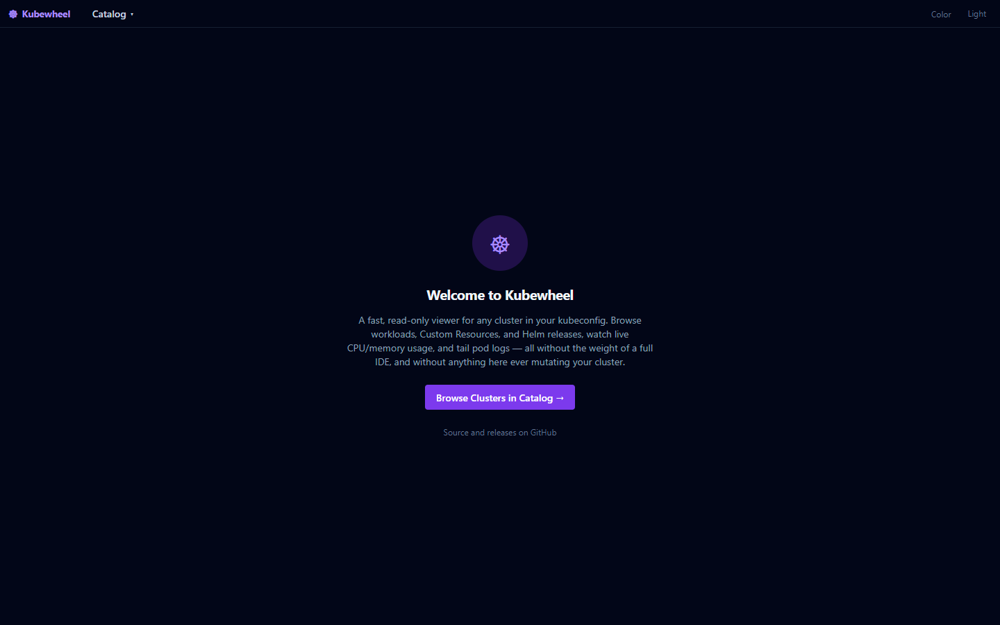
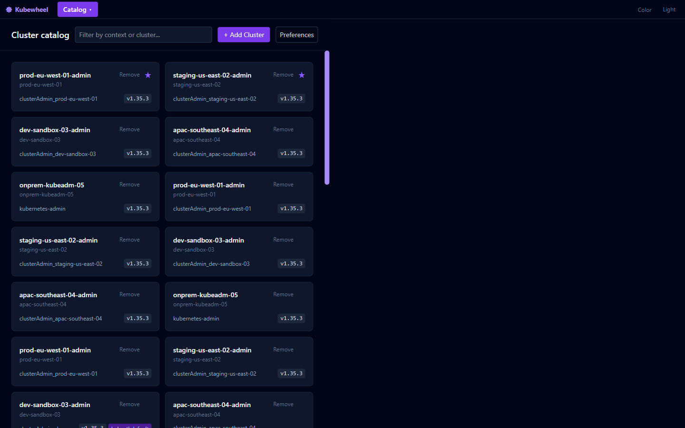
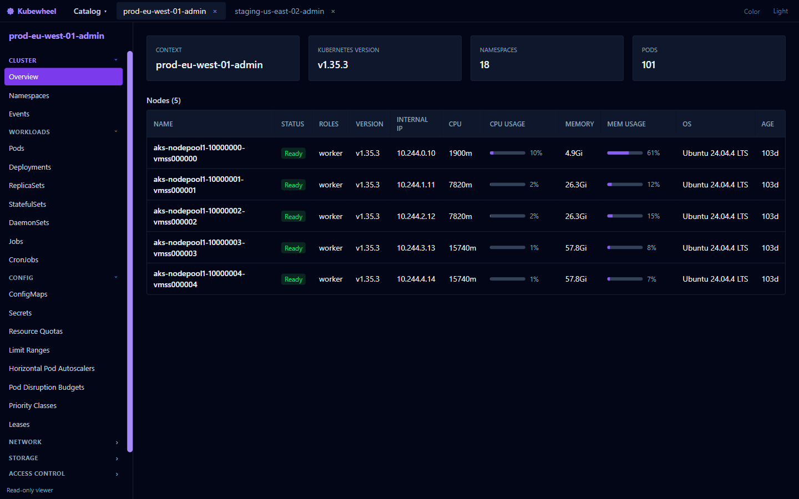
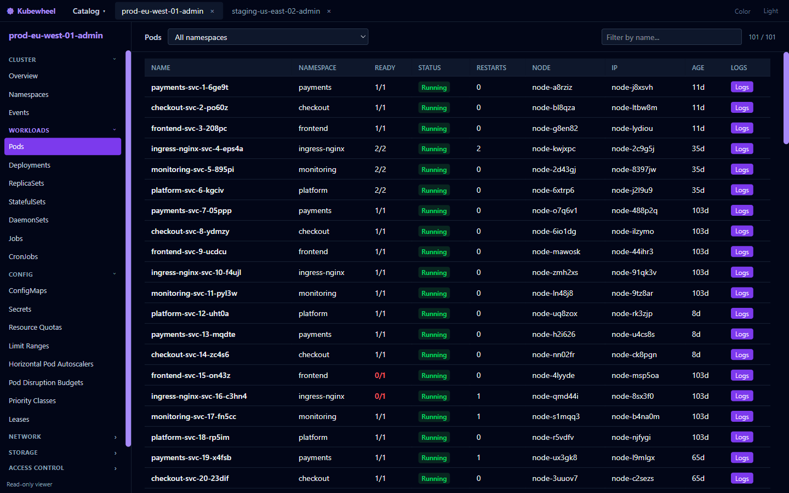

# Kubewheel ☸

A small, read-only Kubernetes cluster viewer for Windows, macOS, and Linux. The name and symbol
come from Kubernetes' own etymology — the Greek *kybernetes* (helmsman/ship's pilot) is also where
the wheel in the Kubernetes logo comes from.

Works against **any** cluster in your kubeconfig — AKS, EKS, GKE, or a bare-metal `kubeadm`
install — since it talks to the standard Kubernetes API via whatever auth your kubeconfig context
already uses (including `exec`-based plugins like `kubelogin`). Built as a lightweight alternative
to Lens/Freelens for one use case: quickly browsing what's running on a cluster, without the weight
of a full IDE.

## Screenshots

| Home | Cluster catalog |
| --- | --- |
|  |  |

| Cluster overview | Resource browser |
| --- | --- |
|  |  |

*(Cluster, namespace, node, and IP names in these screenshots are synthetic placeholders, not real
infrastructure.)*

## Download

Grab the latest installer for your OS from the [Releases page](https://github.com/Babug01/kubewheel/releases):

- **Windows** — `kubewheel-vx.y.z-windows-x64-setup.exe` (installer) or the `-portable.exe` build
- **macOS** — `kubewheel-vx.y.z-macos-x64.dmg` (Intel) or `-macos-arm64.dmg` (Apple Silicon)
- **Linux** — `kubewheel-vx.y.z-linux-x64.AppImage` or the `-linux-x64.deb`

These builds are unsigned (no paid code-signing certificate), so your OS will show a first-run
warning — Windows SmartScreen ("Windows protected your PC" → More info → Run anyway) or macOS
Gatekeeper (right-click the app → Open, instead of double-clicking). This is normal for small
open-source tools without a commercial signing budget; nothing about the warning is specific to
this app.

### Installing from the command line

After downloading, the equivalent of the click-through steps above from a terminal:

**Windows** (PowerShell)

```powershell
.\kubewheel-vx.y.z-windows-x64-setup.exe      # installer
.\kubewheel-vx.y.z-windows-x64-portable.exe   # or: portable build, no install needed
```

**macOS** (Terminal) — after opening the `.dmg`:

```bash
cp -R "/Volumes/Kubewheel/Kubewheel.app" /Applications/
xattr -cr /Applications/Kubewheel.app   # clears the quarantine flag Gatekeeper checks
open /Applications/Kubewheel.app
```

**Linux**

```bash
# .deb (Debian/Ubuntu)
sudo dpkg -i kubewheel-vx.y.z-linux-x64.deb

# AppImage (any distro)
chmod +x kubewheel-vx.y.z-linux-x64.AppImage
./kubewheel-vx.y.z-linux-x64.AppImage
```

## Features (read-only)

- Cluster catalog — every context in `~/.kube/config` as a searchable, favoritable card grid, plus
  a quick-access dropdown off the tab bar's Catalog button for one-click switching to a favorited
  cluster without leaving whatever you're looking at
- Multi-cluster tabs — open several clusters at once, each with its own independent connection;
  open tabs and favorites persist across restarts
- Cluster overview — node list (status, roles, version, CPU/memory), Kubernetes version,
  pod/namespace counts
- Live metrics — per-node and cluster-wide CPU/memory usage bars plus a rolling 2-minute sparkline,
  read directly from `metrics.k8s.io` (no Prometheus needed, unlike Lens/Freelens' metrics — so it
  works on clusters that have metrics-server but not a Prometheus stack)
- Resource browser covering 31 kinds across Workloads, Config, Network, Storage, and Access
  Control, plus Namespaces and Events — per-namespace or across all namespaces, with name filtering
- Custom Resources — every CRD on the cluster, grouped by API group like `kubectl api-resources`.
  Instance tables use the CRD's own `additionalPrinterColumns` (the same schema `kubectl get`
  reads), including the `conditions[?(@.type=="X")]` filter pattern cert-manager, ArgoCD, and most
  controllers use for their Ready/Status columns — not a generic Name/Age table
- Helm Releases — decodes the release Secrets Helm 3 stores in-cluster directly (no `helm` binary
  needed), showing chart, versions, revision, and status
- YAML detail view for any resource, with managed-fields stripped for readability
- Secret values are masked by default with a per-key Show/Hide toggle and Copy button, matching
  Freelens — not hard-redacted, since anyone who can view a Secret here already has equivalent
  access via `kubectl get secret -o jsonpath | base64 -d`
- Live pod log viewer — container picker, tail length, follow/stream toggle
- Health-colored status cells — bad states (CrashLoopBackOff, Failed, ImagePullBackOff, ...) and
  not-fully-ready counts (`1/2`) are flagged red/amber across every table
- Collapsible sidebar groups that remember which are open and auto-expand whichever holds the
  active view
- Six accent color presets, swapped at runtime with no rebuild needed

Nothing here mutates the cluster — no edit, no delete, no exec, no scale. It only ever issues
`get`/`list` calls against the Kubernetes API.

## Why I built this

Freelens/Lens cover a lot of ground, but for a quick "what's running and is it healthy" check I
wanted something smaller and faster to open, that still goes deeper than `kubectl` alone — like
resolving a Custom Resource's own `kubectl get`-style columns, or reading live metrics without
standing up Prometheus. This started as one piece of a larger internal platform-engineering tool
and grew into its own project once the Kubernetes-specific parts stood on their own.

## Tech Stack

Electron + Vite + React + TypeScript + Tailwind CSS, using
[`@kubernetes/client-node`](https://github.com/kubernetes-client/javascript) as the API client.

## Development

```bash
git clone https://github.com/Babug01/kubewheel.git
cd kubewheel
npm install
npm run dev        # launch in dev mode
npm run typecheck  # type-check main + renderer
```

## Building installers

```bash
npm run dist:win    # NSIS installer + portable .exe (Windows only)
npm run dist:mac     # .dmg, Intel + Apple Silicon (macOS only)
npm run dist:linux   # AppImage + .deb (Linux only)
```

electron-builder cross-compiles some of this, but not reliably for every target — the
[release workflow](.github/workflows/release.yml) instead builds each platform on its own native
GitHub Actions runner and attaches the results to a GitHub Release whenever a `v*` tag is pushed.

## License

MIT — see [LICENSE](LICENSE).
